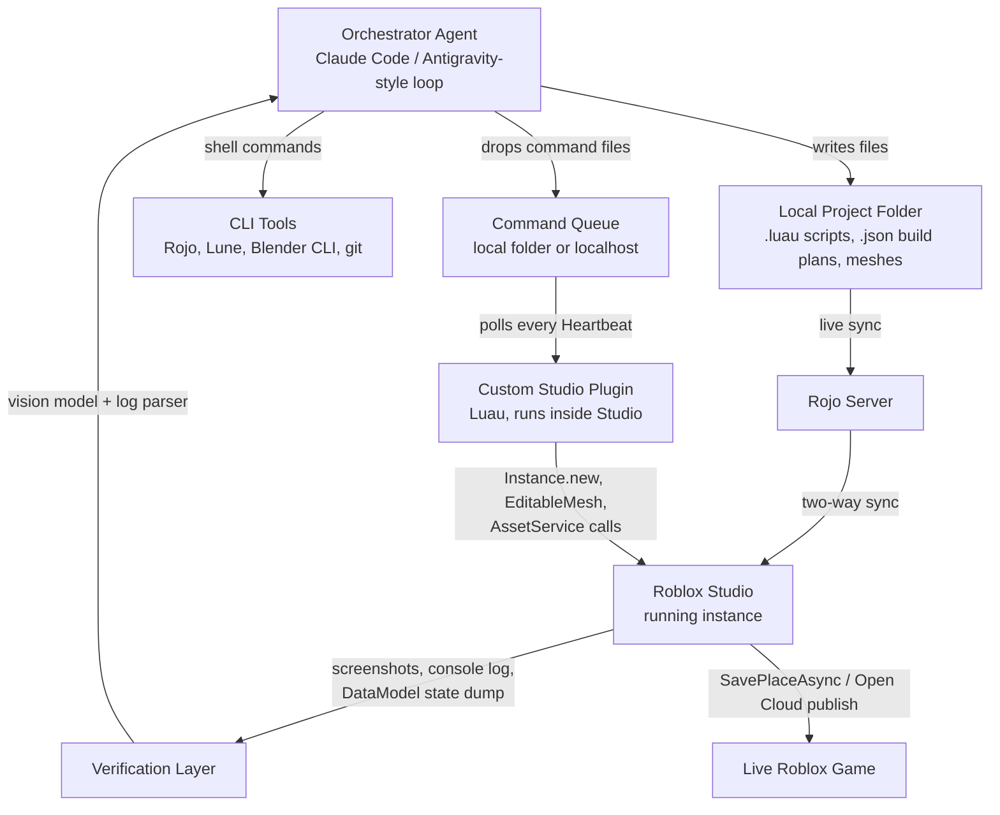

# Autonomous AI Roblox Game Builder — Architecture Framework

## 0. The core design decision

There are two fundamentally different ways to build this:

| Approach | How it works | Why you don't want it |
|---|---|---|
| **"API-based AI"** | Your agent calls Roblox's cloud REST API (Open Cloud) to upload assets / publish places, and calls an LLM API to generate text/code, gluing them together server-side | Brittle, limited surface area (Open Cloud doesn't expose full Studio authoring), feels like a wrapper script, not a "developer" |
| **"Agent controls the tools" (what you want)** | An autonomous coding agent (Claude Code / Antigravity-style) operates a real local dev environment: it edits files, runs CLI tools, drives a Studio plugin, reads console output, looks at screenshots — exactly like a human Roblox developer would, just automated | Gives the agent the *entire* Studio surface, works with existing free tooling, is inspectable/debuggable, and scales to "fully autonomous" because it's a closed perceive→act→verify loop on your own machine |

You're describing the second one. Good instinct — it's also just how Antigravity/Claude Code/computer-use agents already operate: filesystem + terminal + a control surface, not a bespoke API wrapper.

---

## 1. High-level architecture



The agent never "calls the Roblox API" to *author* content. It writes Luau/JSON files to disk and drops small command files into a queue; a plugin running inside Studio (which you build once, deterministically — no AI in the plugin itself) picks them up and executes them using Studio's own Instance/Asset APIs. That's your "lower level, CMD-controllable" surface.

---

## 2. Components

### 2.1 Orchestrator (the agent)
This is Claude (via Claude Code) or a similar agentic loop with:
- A planner that breaks "build a obby game" → subtasks (level layout, meshes needed, scripts needed, tuning pass)
- Tool access: filesystem read/write, shell execution, image viewing (for screenshots)
- A persistent scratch memory of the project state (what's been placed, what scripts exist, open bugs)

This part is basically what Claude Code / Antigravity already give you — you don't need to build an agent loop from scratch, you need to give an existing one the right tools (below) and a good system prompt describing the project structure and conventions.

### 2.2 Filesystem ↔ Studio bridge: **Rojo**
[Rojo](https://rojo.space) is the standard open-source tool Roblox devs use to sync a folder of `.luau`/`.lua` files (plus a `default.project.json` describing the DataModel tree) into a running Studio session in real time, and back out again.

- The agent writes/edits plain `.luau` files in a normal folder — no Studio interaction needed for scripting.
- `rojo serve` runs as a background CLI process; the Rojo Studio plugin (installed once) connects to it and live-syncs.
- This alone gives you **full scripting automation via CMD** — the agent can write a script file and it appears in the running game within seconds, fully commit/diffable in git.

Install: `cargo install rojo` or via the `.rbxm` plugin + `rojo` binary. This is the backbone — get this working first.

### 2.3 In-Studio actuator: a custom Studio Plugin
Rojo handles *scripts and static structure* well, but some actions need to happen from *inside* Studio using its live APIs: inserting meshes via `AssetService`, using `EditableMesh`, running `GenerationService:GenerateMeshAsync`, moving the camera for a screenshot, hitting Play, reading `output` panel errors, or publishing.

Build a small, **non-AI, deterministic** plugin (Luau, ~a few hundred lines) that:
1. Polls a local command queue every `RunService.Heartbeat` (e.g. reads new `*.json` files from `./agent_commands/` — Rojo can sync this folder in too, or the plugin can use `HttpService:RequestAsync("http://localhost:PORT/next-command")` against a tiny local server your orchestrator hosts)
2. Executes a small fixed vocabulary of commands: `insert_mesh`, `generate_mesh_from_text`, `set_property`, `run_script`, `take_screenshot`, `enter_play_mode`, `read_output`, `publish`
3. Writes results/errors back to a `./agent_results/` folder (or POSTs them to the local server) so the agent can read them

This is your "lower-level control, not API-based" layer — it's just Luau code running inside the actual application, driven by files/local sockets instead of Roblox's cloud API. Roblox has zero problem with this; it's literally what plugins are for.

**Local command protocol (keep it dead simple):**
```json
// agent_commands/0001_place_sword.json
{
  "id": "0001",
  "action": "generate_mesh_from_text",
  "params": { "prompt": "medieval longsword", "suggestedSize": [0.3, 4, 0.3] },
  "then": { "action": "insert_at", "parent": "Workspace", "position": [10, 5, 10] }
}
```
```json
// agent_results/0001_result.json
{ "id": "0001", "status": "ok", "instancePath": "Workspace.GeneratedSword_0001" }
```

### 2.4 Mesh generation
You have three tiers, use the cheapest that works and fall back:

1. **`GenerationService:GenerateMeshAsync`** (Roblox's built-in Cube 3D model) — text prompt → mesh, called from inside a Studio-context script (via your plugin, since it needs a `Player`/Studio security context). Fastest path, zero external tools, but you don't control style precisely.
2. **`EditableMesh`** — for procedural geometry you compute yourself (terrain, tracks, deformable props, primitives assembled programmatically). Your agent generates the vertex/face math (this is a great fit for an LLM writing a Luau procedural-generation module), the plugin executes it. Limits: 60,000 vertices / 20,000 triangles per mesh, and it only runs live in a *published* experience if the account is age + ID verified with the "Allow Mesh & Image APIs" security toggle on — fine in Studio/dev, so keep this as an authoring-time tool and bake the result into a normal `MeshPart` before shipping if you want it to work for all players.
3. **External DCC pipeline (Blender)** — for complex organic assets, run Blender headless via CLI (`blender --background --python script.py`) to generate `.fbx`/`.obj`, then import through Studio's asset pipeline (still driver-able from your plugin/CLI, not Roblox's cloud asset API). Use this when you need shapes an LLM can't reasonably parameterize by hand.

### 2.5 Scripting
Straightforward: the agent writes Luau directly into the Rojo-synced project (`src/ServerScriptService/...`, `src/StarterPlayerScripts/...`, etc.), following whatever module conventions you set up. This is the part closest to normal Claude Code usage — no special tooling needed beyond Rojo.

### 2.6 Verification / feedback loop
Autonomy lives or dies on this part. Give the agent a way to *check its own work*:
- **Console/log capture**: your plugin reads `LogService` output and dumps errors/warnings to `agent_results/log.json` after each change or play-test
- **Headless test runner**: [Lune](https://lune-org.github.io/docs) (a standalone Luau runtime) lets you unit-test pure logic (math, procedural mesh functions, game rules) from the CLI with no Studio open at all — fast inner loop before touching Studio
- **Visual verification**: the plugin takes a viewport screenshot (`ScreenshotHudService`/GUI capture) and saves it to disk; the agent (as a vision-capable model) looks at it to confirm "yes, the sword is actually where I meant it to be" — this is the same pattern computer-use agents use to check their work
- **Play-mode smoke test**: plugin triggers Studio's Play button, waits N seconds, reads output for errors, stops — cheap automated regression check after each batch of changes

### 2.7 Publishing
Two options, pick based on how "hands-off" you want this:
- **In-Studio**: plugin calls the save/publish flow Studio itself exposes to plugins (subject to plugin permission scopes)
- **Open Cloud `publish` endpoint**: this *is* a Roblox cloud API call, but only for the final "ship it" step, not for authoring — reasonable to use here since it's just moving a finished place file, not something you're trying to avoid on principle

---

## 3. Suggested stack

| Layer | Tool |
|---|---|
| Agent runtime | Claude Code (or similar agentic CLI loop) |
| File sync | Rojo |
| In-Studio actuator | Custom Luau plugin (you write this once) |
| Headless testing | Lune |
| Mesh (fast/generic) | `GenerationService` (Cube 3D) |
| Mesh (procedural) | `EditableMesh` + agent-written Luau math |
| Mesh (complex/organic) | Blender CLI → import |
| Version control | git (Rojo project = plain text, diffs beautifully) |
| Verification | Screenshot + vision, LogService capture, Lune tests |

---

## 4. Build order (MVP → full autonomy)

1. **Get Rojo working manually** — sync a hand-written script into Studio, confirm the loop. Do this yourself first, no AI involved, so you trust the substrate.
2. **Wire the agent to write Rojo project files via CLI** — have Claude Code edit a script, you visually confirm it lands in Studio.
3. **Build the minimal plugin**: just `insert_mesh` (a primitive Part) + `read_output`. Prove the command-queue round-trip works.
4. **Add screenshot capture + vision verification** — close the perceive/act loop.
5. **Add `GenerateMeshAsync`** for real mesh generation.
6. **Add play-mode smoke testing.**
7. **Add EditableMesh procedural generation** for one asset class (e.g., terrain chunks).
8. **Only then** wire up publish — keep a human-approval gate here for a good while.

---

## 5. Constraints to design around, not discover the hard way

- **EditableMesh in published games requires age + ID verification** on the account and a security toggle — fine for dev, plan for it if you want runtime mesh editing to work for end players.
- **Mesh limits**: 60k vertices / 20k triangles per `EditableMesh`.
- **No true file-system watcher inside Studio plugins** — you're polling on `Heartbeat`/`RenderStepped`, not getting push notifications; keep the queue lightweight.
- **GUI-automation (mouse/keyboard) should be your last resort**, only for the handful of actions with no scriptable equivalent (if any remain) — it's fragile and slower than the plugin/Rojo path, which covers the vast majority of what you need.
- **Roblox ToS**: authoring content this way is fine (plugins, Rojo, and Open Cloud are all sanctioned developer tooling) — just don't automate anything that impersonates player behavior (auto-farming, fake engagement) on *published* games, that's a different category of automation with real ToS risk.

---

## 6. What to build next

If you want, I can help with:
- The actual Luau source for the command-queue plugin (step 3 above)
- A `default.project.json` + starter Rojo folder layout
- The Lune test harness scaffold
- The procedural mesh Luau module for a first asset class
